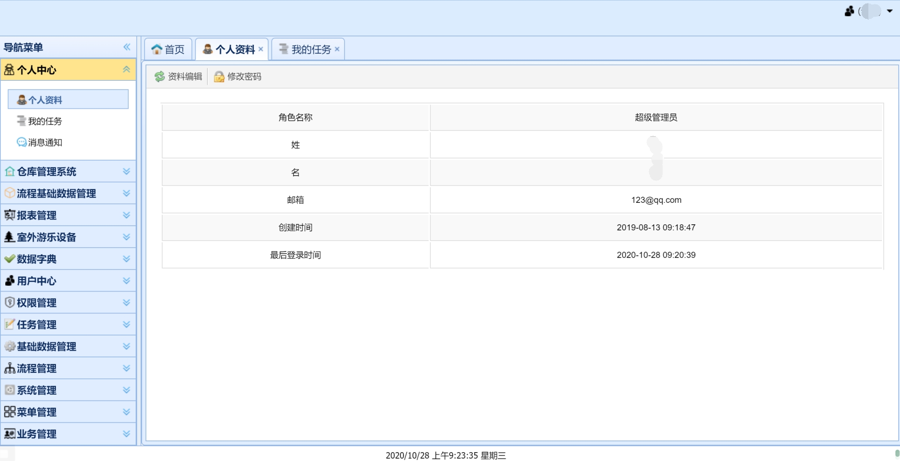
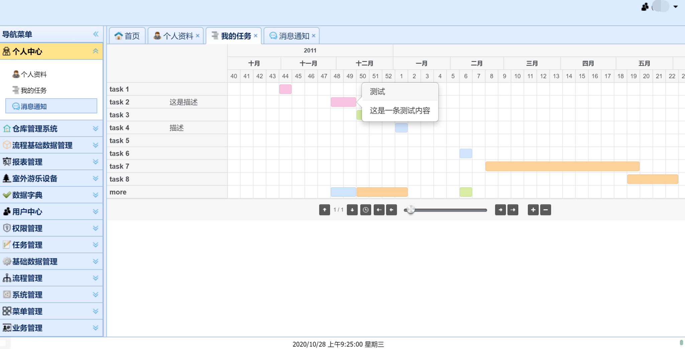
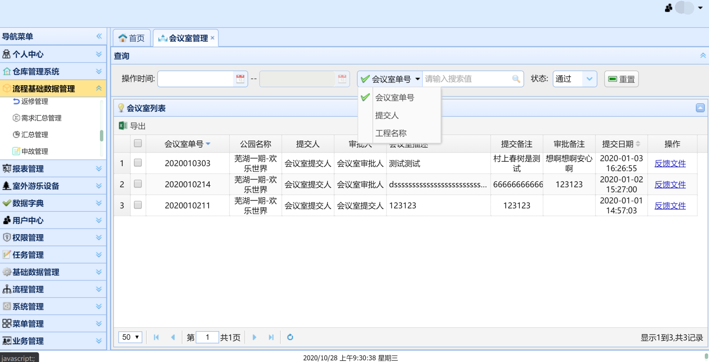
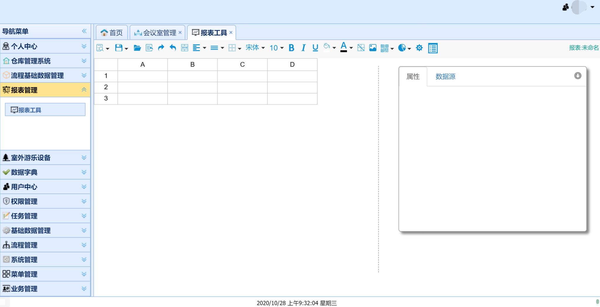
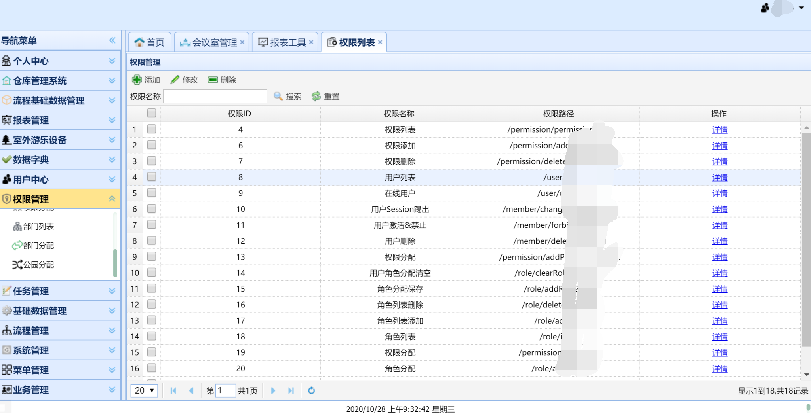
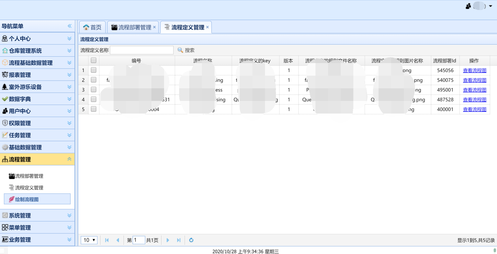
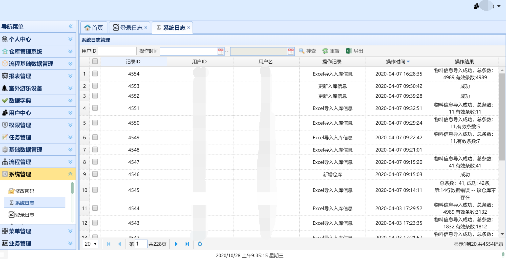
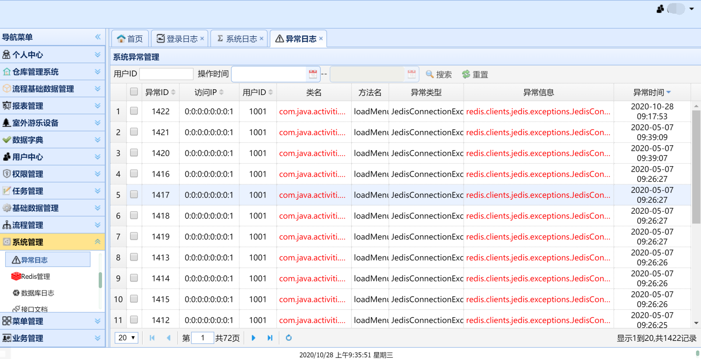
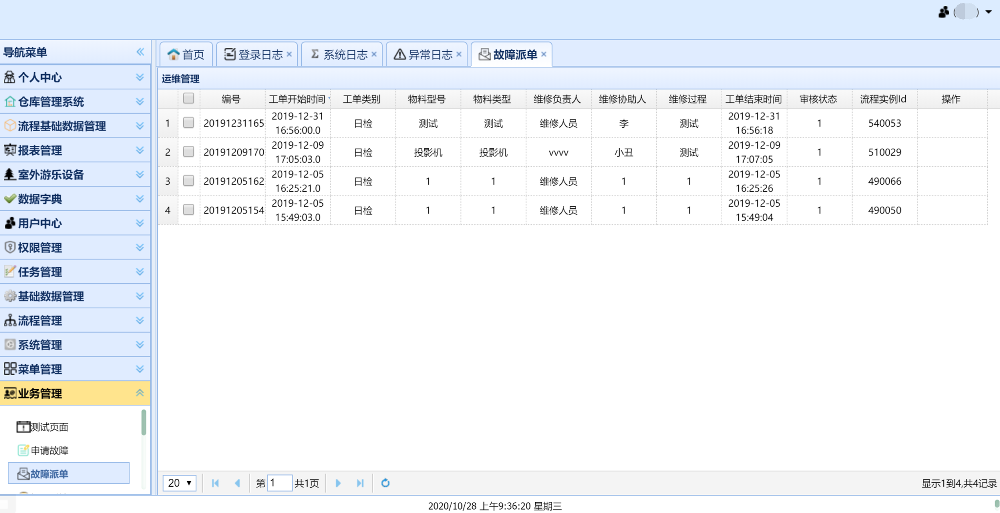

### 基于 SSM+Redis+Activiti+Netty 的基本项目  

### 开发工具

idea  2019.3

### 开发环境

| JDK | Activiti | Pgsql | Spring | redis | Netty |
| :-------------: |:-------------:| :-------------:| :-------------:|:-------------:| :-------------:|
| 1.8  | 5.19.X | 12.0 | 4.3.18.RELEASE | 3.2 | 4.X |

### 项目启动说明

启动前，请配置 config.properties 中相关redis、mysql相关信息

### 其它说明

暂无

### 系统截图

   
   
   
   
   
   
   
   
   

